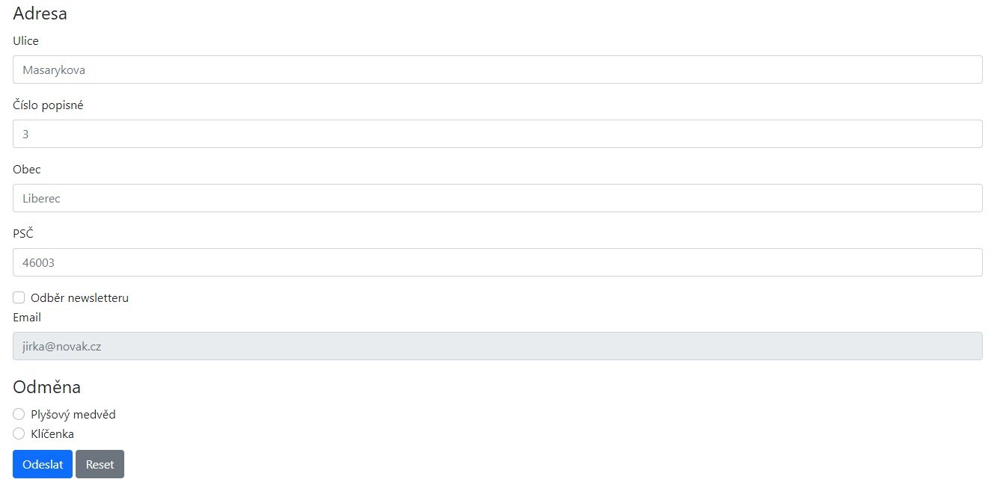
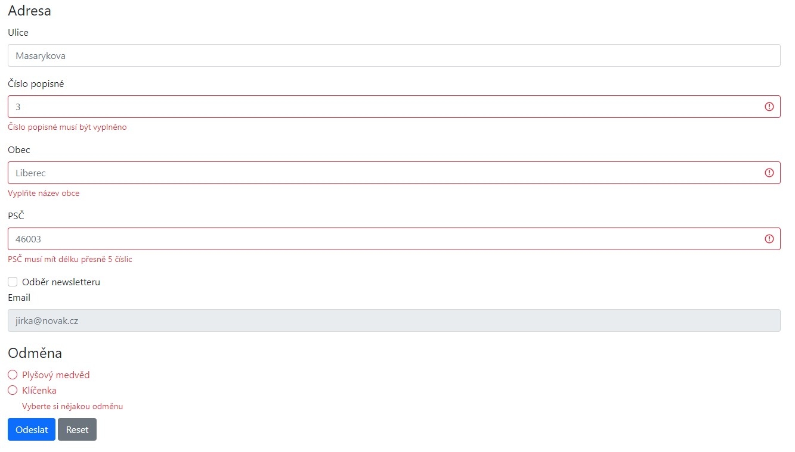
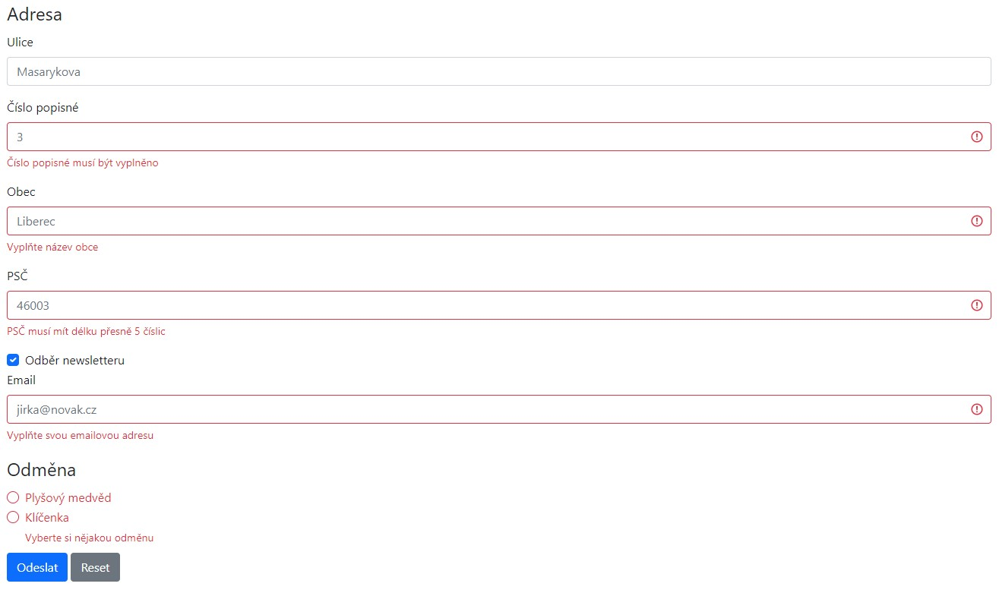
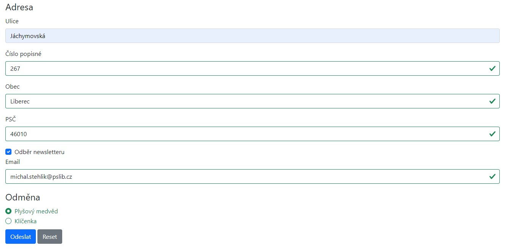

# Validace formuláře 1

Pomocí javascriptu vytvořte kód pro validování následujícího formuláře:

* Ulice (není validována, může být prázdná)
* Číslo popisné (číslo, musí být vyplněno)
* Obec (musí být vyplněna)
* PSČ (číslo, musí být vyplněno a mít přesně 5 číslic)
* Pokud je zaškrtnuto "Odběr něwsletteru"
    * Email (musí být vyplněn a obsahovat znak "@")
* Odměna (musí být vybrána)

Validace probíhá ideálně:

* během editace pole
* po vyplnění pole
* při pokusu o odeslání formuláře

## Screenshoty

"# js-form-validation-demo" 
